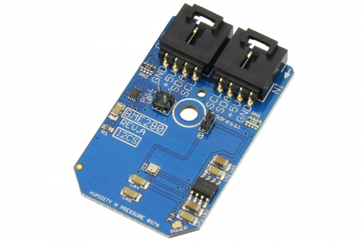

[](https://store.ncd.io/product/bme280-digital-humidity-%C2%B13rh-pressure-and-temperature-sensor-i2c-mini-module/).

# BME280

The BME280 is a combined humidity, pressure and temperature sensor that allows for two devices per I2C port.The humidity sensor in the BME280 provides an extremely fast response time and high overall accuracy with ±3%RH. The pressure sensor in this device is an absolute barometric pressure sensor with extremely high accuracy and resolution and low noise output. The temperature sensor has been optimized for the lowest noise and highest resolution and is used for temperature compensation of the pressure sensor and can also be used for estimation of ambient temperature. 
This Device is available from www.ncd.io

[SKU: BME280]

(https://store.ncd.io/product/bme280-digital-humidity-%C2%B13rh-pressure-and-temperature-sensor-i2c-mini-module/)
This Sample code can be used with Raspberry Pi.

Hardware needed to interface BME280 humidity,pressure and temperature sensor With Raspberry Pi :

1. <a href="https://store.ncd.io/product/bme280-digital-humidity-%C2%B13rh-pressure-and-temperature-sensor-i2c-mini-module/">BME280 humidity,pressure and temperature Sensor</a>

2. <a href="https://store.ncd.io/product/i2c-shield-for-raspberry-pi-3-pi2-with-outward-facing-i2c-port-terminates-over-hdmi-port/">Raspberry Pi I2C Shield</a>

3. <a href="https://store.ncd.io/product/i%C2%B2c-cable/">I2C Cable</a>

## Python

Download and install smbus library on Raspberry pi. Steps to install smbus are provided at:

https://pypi.python.org/pypi/smbus-cffi/0.5.1

Download (or git pull) the code in pi. Run the program.

```cpp
$> python BME280.py
```
The lib is a sample library, you will need to calibrate the sensor according to your application requirement.
